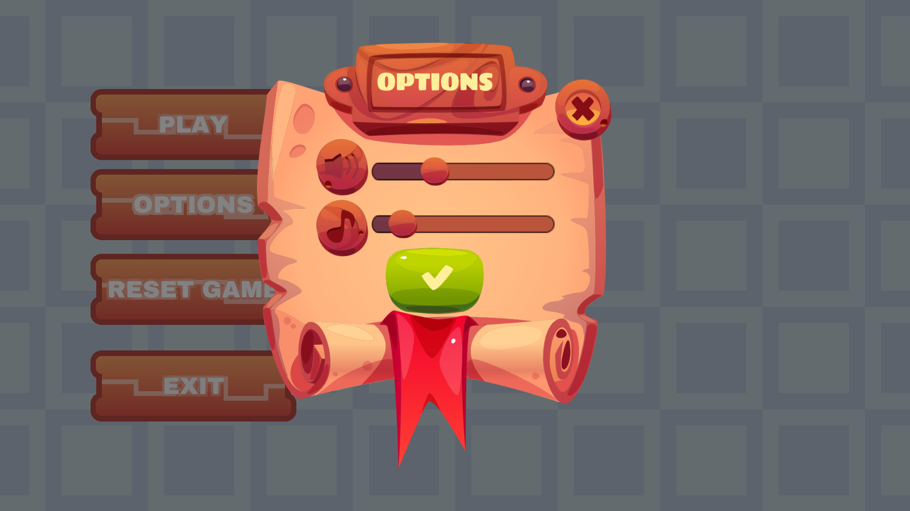
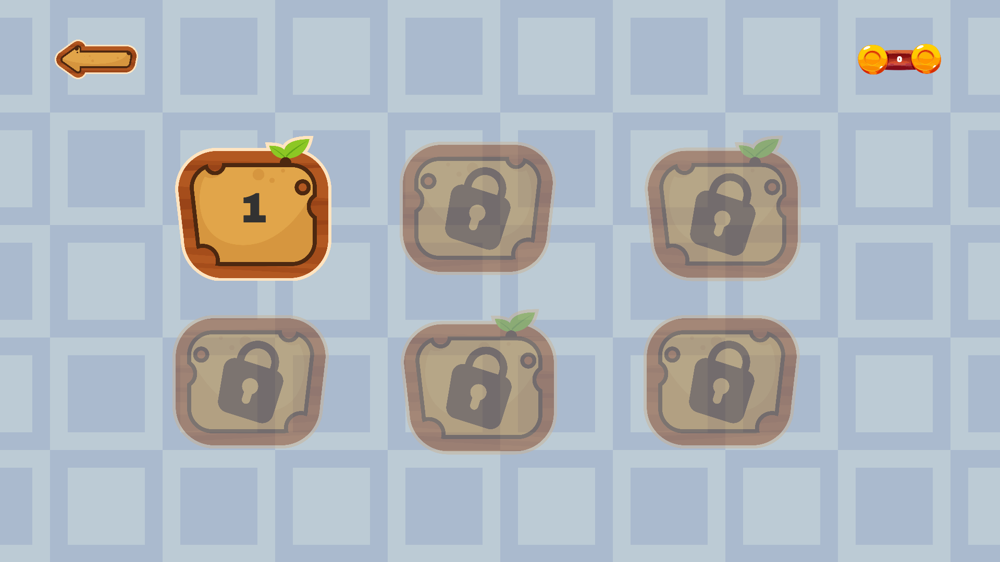
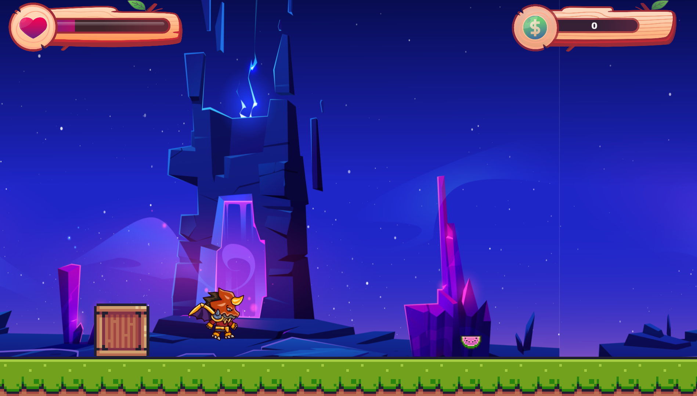
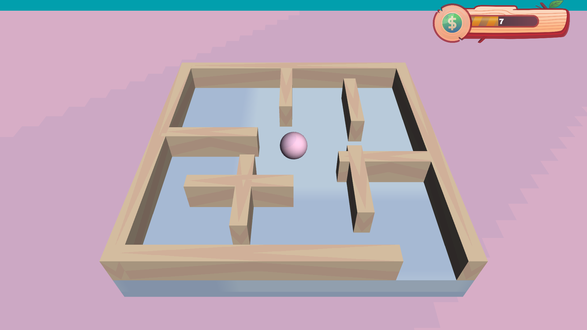
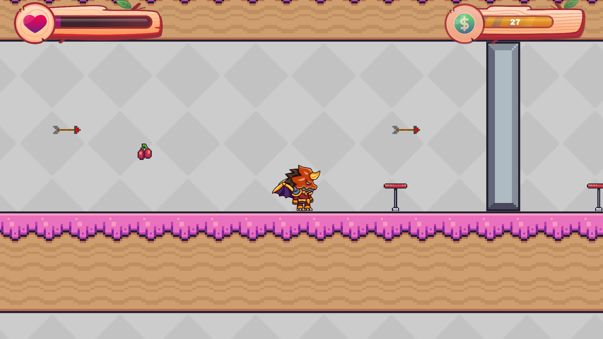
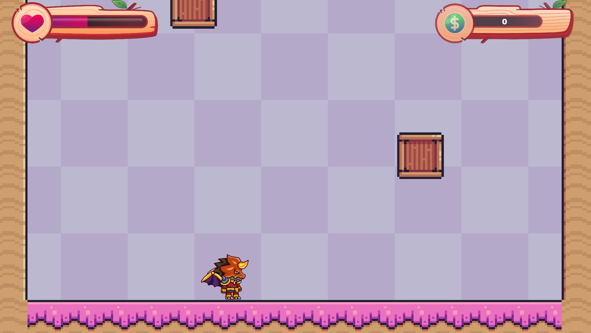
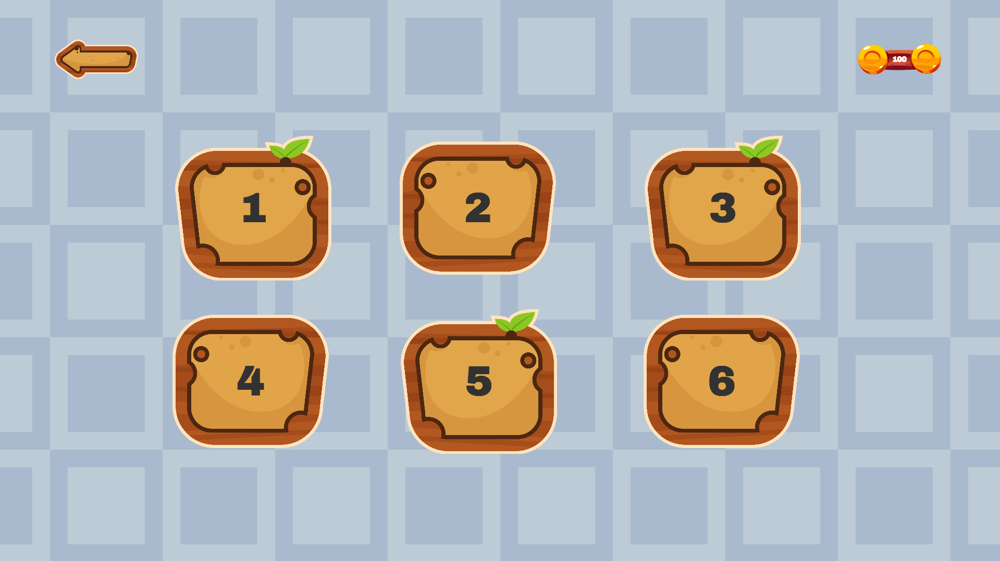

# Game

## Description

The game was created in Unity. It is divided into six levels. The player's task is to collect items and reach the finish line. The player can move the character using the arrow keys.

## Downloads

| Platform | Download Link |
|----------|---------------|
| Linux    | [Download](https://github.com/patrykzawadzkisggw/Game/releases/latest/download/linux.zip) |
| Windows  | [Download](https://github.com/patrykzawadzkisggw/Game/releases/latest/download/windows.zip) |

## Game Screenshots

